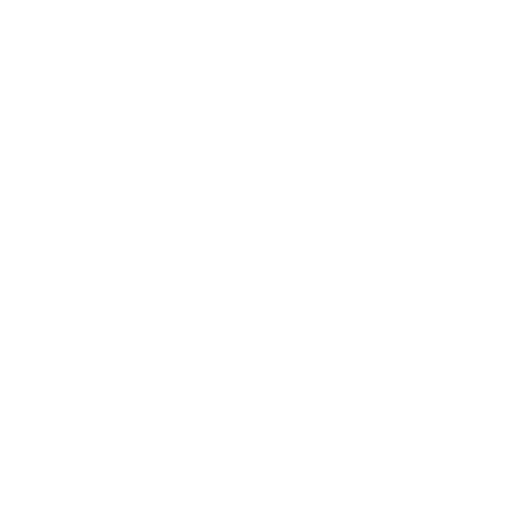

# Let's Eat

  

  <a href="#features">Features</a>
  &nbsp;&nbsp;&nbsp;|&nbsp;&nbsp;&nbsp;
  <a href="#credentials">Credentials</a>
  &nbsp;&nbsp;&nbsp;|&nbsp;&nbsp;&nbsp;
  <a href="#members">Members</a>
  &nbsp;&nbsp;&nbsp;&nbsp;&nbsp;&nbsp;

## Features

- [x] Register
- [x] Login/Logout
- [x] Edit Profile
- [x] Add Restaurant
- [x] Edit Restaurant
- [x] Add Dishes
- [x] Add Dish Photo
- [x] List Reviews
- [ ] Restaurant Owner Can Answer to Review
- [x] List Customer Orders
- [x] Change Order State
- [x] Search Restaurants
- [x] Order Dishes
- [x] List My Orders
- [x] Mark Restaurant as Favourite
- [x] Mark Dish as Favourite
- [x] Customer Can Leave a Review

## Credentials

ex:
admin/v3rystr0ngp4a55w0rd
\
lapizzeria/myr3staurantisth3best
\
johndoe/123456

## Members

|Name               | Up Number        | Git                                         |
| ---               | ---              | ---                                         |
|Marcelo Apolinário |                  | [Maruselo](https://github.com/Maruselo)     |
|Miguel Teixeira    | 202005208        | [teixemigue](https://github.com/teixemigue) |
|Raquel Carneiro    | 202005330        | [shinir](https://github.com/shinir)         |

